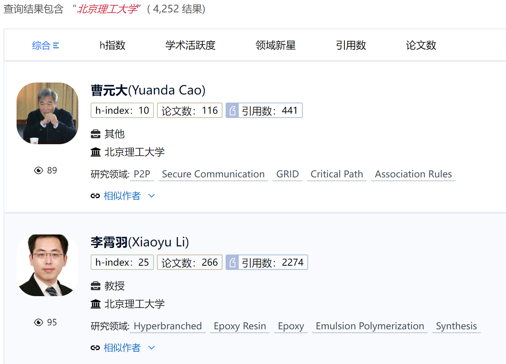
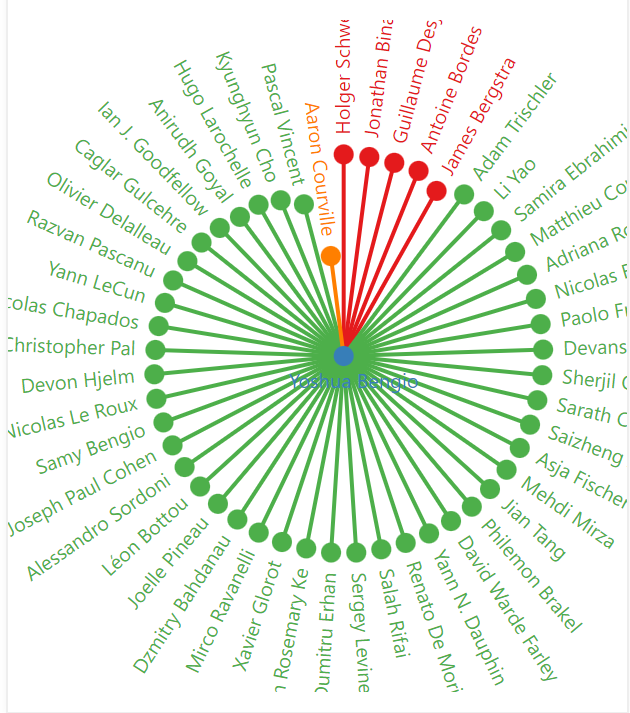
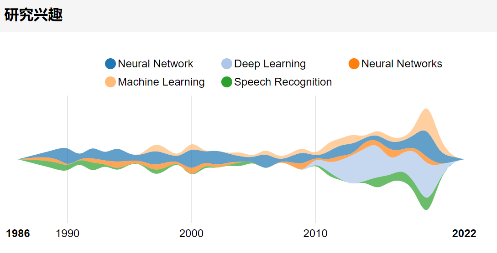
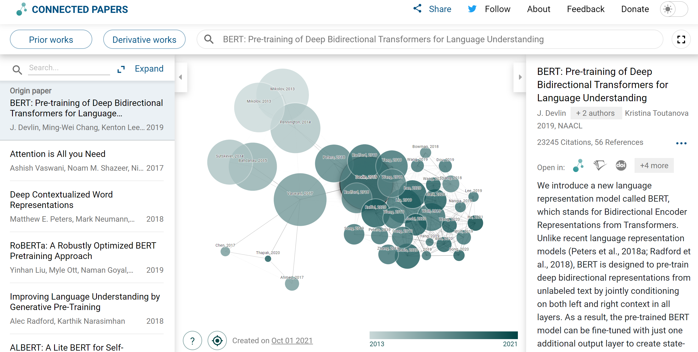

# 作业内容

## Project1: 大规模爬虫

### 爬虫模块

#### 推荐爬取的站点

- ACM：https://dl.acm.org/ 
  - 含作者、摘要、会议、视频、引文等论文相关信息
  - https://dl.acm.org/doi/10.1145/3404835.3462936
- Springer：https://www.springer.com/cn，
  - 含作者、摘要、引文等论文相关信息
  - https://link.springer.com/chapter/10.1007/978-3-030-88483-3_4
- ScienceDirect：https://www.sciencedirect.com/
  - 含作者、摘要、关键词等论文相关信息
  - https://www.sciencedirect.com/science/article/abs/pii/S0004370221001314
- 图书馆数据源：http://lib.bit.edu.cn/node/404.jspx

#### 要求

+ **ACM必选**，要保证爬到的论文中有一定比例的**视频**，可以是在线观看视频的url地址，也可以是下载视频到本地后的文件路径
+ **Springer必选**
+ **ScienceDirect必选**，要求包含**多领域**的数据
+ 图书馆数据源为**可选加分项**
+ 爬到的数据必须存储到[MongoDB](https://www.mongodb.com)中，字段定义详见`sample.json`
+ 数据源越丰富越好，当从不同数据源爬取到相同论文时，需要**去除重复数据**
+ 从每个数据源获取的数据需要具有**完备性**，即爬取数据量占全站数据量的比例越高越好

+ 要求搭建一个完整的**爬虫框架**，在爬取不同的数据源时，只需要根据实际情况，手写少量解析网页的部分，即数据源是可插拔的。此处推荐[Python Scrapy爬虫库](https://scrapy.org)
+ 要求实现**增量式**爬取，定时更新
+ 要求爬虫采用现有工程中常用技术手段（包括但不限于）：
  + 当爬取一个规模较大的网站时，采用某种策略/顺序，保证爬取结果不重不漏
  + 使用多线程/多进程等技术提升爬虫效率
  + 使用ip池、调整等待时间等技术抵御网站反爬
  + 如果网络崩溃，能够从断点续爬
  + 使用日志技术实时展示爬取进度
+ 搭建一个基本的[Elasticsearch](https://www.elastic.co/)+[Kibana](https://www.elastic.co/cn/kibana/)检索系统，对爬取的数据建立索引，方便展示

### 提交内容

+ 一个MongoDB数据库和磁盘文件
+ 在仓库README中给出爬取数据的**统计信息**，例如每个数据源爬取的论文数、字段覆盖率等

## Project2: 学者检索引擎

### 爬虫模块

#### 推荐爬取的站点

+ AMiner: https://www.aminer.cn/
+ Semantic Scholar：https://www.semanticscholar.org/
+ 全球学者库：http://www.globalauthorid.com/

#### 要求

+ **AMiner必选**，爬取作者信息，作者之间共同著作、所属机构等信息，以[Bengio](https://www.aminer.cn/profile/yoshua-bengio/53f4ba75dabfaed83977b7db)为例
+ **Semantic Scholar必选**
+ 爬到的数据必须存储到**MongoDB**中，字段必须定义清晰
+ 当爬取到重名作者时，需要做到**重名区分**和**同人合并**
  + 可以利用机构、共同著作等信息

### 检索模块

#### 要求

+ 从MongoDB中读取数据实现**综合检索**，要求无论是输入作者姓名、作者机构、领域、论文名称，都能得到相应的检索结果，如下例所示：

+ 可以自己实现搜索算法，也可以使用已有的搜索引擎工具，比如**Elasticsearch**（[https://www.elastic.co](https://www.elastic.co/)）
+ 要求展示模块提供**作者网络信息**，可以根据数据库中爬取到的信息，也可以自行分析论文、引文等
+ 利用已有数据对学者进行额外分析是**可选加分项**，例如师门关系、搜索过程中的学者对齐

### 展示模块

#### 要求

+ 设计并实现一个学者搜索引擎网站，包括三个页面：

  + 首页/搜索页

  + 检索结果列表页

  + 作者**Profile页面**，可参考AMiner：

    + 必须包括：

      + 作者个人信息：姓名、照片、职称、所属机构
      + 作者发表论文
      + 作者关系网络，要求以**可视化**形式展现
      
      

        
      

    + 可选加分项：

      + 研究兴趣
      
      

        
      

      
      + H-Index、G-Index等作者统计信息
      
      + 其他有创意的趣味展示

+ 推荐使用Python Django（[https://www.djangoproject.com](https://www.djangoproject.com/)）库来实现

### 提交内容

+ 一个MongoDB数据库
+ 在仓库README中给出爬取数据的**统计信息**，例如每个数据源爬取的学者数、字段覆盖率等

+ 验收时，展示学者检索引擎的检索结果

## Project3: 基于引文网络的论文检索引擎

引文网络是由文献间引用和被引用的关系构成的集合。该网络中的节点是文献，边代表了文献间的引用关系。

### 数据处理模块

+ Semantic Scholar上从2000年以后的英文论文，大小为**120G**，每条数据包含论文标题、论文引用和被引关系，该数据在选题后找助教拷贝

#### 要求

+ 使用大规模数据处理技术，例如Spark
+ 构建**引文网络**来计算论文重要性分数
  + 使用的算法必须说明原理
  + 基于引文网络的重要性分数必须作为一个字段保存进MongoDB数据库

### 检索模块

+ 搭建Elasticsearch实现从某一个或若干字段检索
+ 再**结合**引文网络重要性分数对检索结果进行调整，对比二者，期望引文网络重要性分数对搜索结果有所改善，能结合**具体案例**分析说明
+ 当选中一篇论文后，能够以该节点为中心展示引文网络子图
  + 应当包括之前和之后的节点
  + 应根据节点互相引用的关系、节点重要性筛选出一定数量的节点用于展示
  + 应提供引文网络子图的节点和边的信息，并和展示模块商量好接口定义

### 展示模块

- 设计并实现一个学术论文搜索引擎网站，包括三个页面

  - 首页/搜索页
  - 检索结果列表页，要求：
    - 可以显示ES基础检索结果列表
    - 可以显示基于引文网络重要性分数改善后的检索结果列表

  + 论文详情页面：

    + 基于选中的论文，可视化一个**引文网络子图**，可以参考https://www.connectedpapers.com/。根据重要性分数，节点的大小或颜色应该有所区分
    
    

      
    

- 推荐使用Python Django（[https://www.djangoproject.com](https://www.djangoproject.com/)）库来实现

#### 提交内容

+ 一个MongoDB数据库，包含引文网络重要性字段
+ 引文网络的统计信息，节点数、边数、最大出入度等
+ 展示基于引文网络的论文检索引擎的检索结果，并能结合**具体案例**说明基于引文网络的重要性分数对检索结果的改善
+ 展示引文网络子图的可视化效果

# 组队要求

- 分为12个组，每组6人。组内可能会涉及到爬虫、检索、展示等多维度的工作，希望合理分工，紧密配合

- 在**10.23日23:55分**前完成组队，由组长在[腾讯文档](https://docs.qq.com/sheet/DRG1mVW1vUUtQQ0tw)中填写队伍信息

- 在**10.24日23:55分**填写志愿，选择想要完成的Project

- 在**10.25日10点**由助教统一抽选，公布选题结果

- 公布每组选题后，每位同学点击以下链接，按照GitHub Classroom引导完成操作：

  - Project1 : https://classroom.github.com/a/TPfG7zoF
  - Project2 : https://classroom.github.com/a/P5Yd2iMJ
  - Project3 : https://classroom.github.com/a/1HrHYEFk

  其中，队长负责创建队伍，其余队员加入已有队伍即可。注意，队名只能是英文名

- 最终所有仓库都会建立在[BITCS-Information-Retrieval-2021-2022](https://github.com/BITCS-Information-Retrieval-2021-2022)这个GitHub Organization账号下
